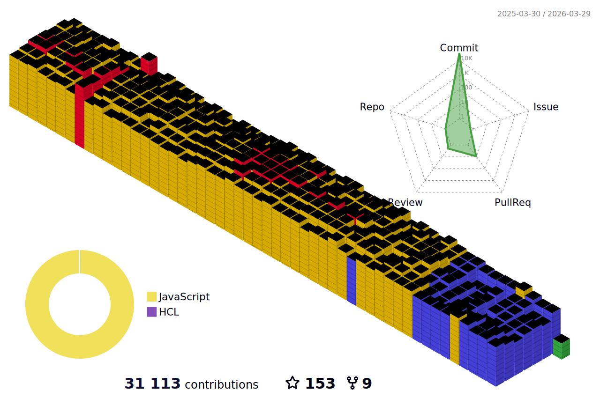

<h5 align="center">💬 Follow</h5>
<div align="center">

[](https://www.facebook.com/Horisyo/)
[](https://www.instagram.com/jrzvnn_/)
[](https://twitter.com/jrz_studies)
[](https://open.spotify.com/user/217td4qrc6mzqjodfalmzjpdi?si=b93099b9078c4ccb)
[](https://www.linkedin.com/in/jrz-vnn/)
[](mailto:jrzvnn@gmail.com)

</div>
<!--🖼️SVG BANNER / 🌐WEBSITE: https://github.com/Akshay090/svg-banners -->
<p align="center">

<h4 align="center"><samp>Greetings 👋, fellow code adventurer! Prepare to embark on a journey through my GitHub repository, where every line of code has been carefully crafted to deliver maximum pun-tastic enjoyment. 🚀 </samp></h4>

<div align="center">
	
</div>
&nbsp; 

* 💻 I’m an Artificial Intelligence intern, taking up Computer Science 
* 🤖 Learning NLP, AWS and FERN Stack.
* 🎯 Life Hack: Talking to a rubber ducky uncovers hidden coding errors 
* ⚡ Fun fact: Can solve a Rubik's Cube less than 15 seconds
* 👉 `npx jrzvnn` Hit in your console or terminal to connect with me.
* 📫 How to reach me: jrzvnn@gmail.com

<br/>
<div align="center" > 
 
</div>
<br />
 <div style="display: flex; align-items: flex-start; flex-wrap: wrap;" align="center">
 
  
  
  
  
  
  
   <br />
  
  
  
  
  
  
  
   <br />
  
  
  
  
  
  
  
  
  
  
</div>

<br />
<br />
<!--🖼️OCTOCAT-->
<p align="center">
</p>

<br />


<div align="center">

<!--START_SECTION:waka-->


**I'm a Night 🦉** 

```text
🌞 Morning                35 commits          ⬛⬛⬜⬜⬜⬜⬜⬜⬜⬜⬜⬜⬜⬜⬜⬜⬜⬜⬜⬜⬜⬜⬜⬜⬜   08.06 % 
🌆 Daytime                169 commits         ⬛⬛⬛⬛⬛⬛⬛⬛⬛⬛⬜⬜⬜⬜⬜⬜⬜⬜⬜⬜⬜⬜⬜⬜⬜   38.94 % 
🌃 Evening                97 commits          ⬛⬛⬛⬛⬛⬛⬜⬜⬜⬜⬜⬜⬜⬜⬜⬜⬜⬜⬜⬜⬜⬜⬜⬜⬜   22.35 % 
🌙 Night                  133 commits         ⬛⬛⬛⬛⬛⬛⬛⬛⬜⬜⬜⬜⬜⬜⬜⬜⬜⬜⬜⬜⬜⬜⬜⬜⬜   30.65 % 
```
📅 **I'm Most Productive on Thursday** 

```text
Monday                   41 commits          ⬛⬛⬜⬜⬜⬜⬜⬜⬜⬜⬜⬜⬜⬜⬜⬜⬜⬜⬜⬜⬜⬜⬜⬜⬜   09.45 % 
Tuesday                  96 commits          ⬛⬛⬛⬛⬛⬛⬜⬜⬜⬜⬜⬜⬜⬜⬜⬜⬜⬜⬜⬜⬜⬜⬜⬜⬜   22.12 % 
Wednesday                77 commits          ⬛⬛⬛⬛⬜⬜⬜⬜⬜⬜⬜⬜⬜⬜⬜⬜⬜⬜⬜⬜⬜⬜⬜⬜⬜   17.74 % 
Thursday                 170 commits         ⬛⬛⬛⬛⬛⬛⬛⬛⬛⬛⬜⬜⬜⬜⬜⬜⬜⬜⬜⬜⬜⬜⬜⬜⬜   39.17 % 
Friday                   14 commits          ⬛⬜⬜⬜⬜⬜⬜⬜⬜⬜⬜⬜⬜⬜⬜⬜⬜⬜⬜⬜⬜⬜⬜⬜⬜   03.23 % 
Saturday                 7 commits           ⬜⬜⬜⬜⬜⬜⬜⬜⬜⬜⬜⬜⬜⬜⬜⬜⬜⬜⬜⬜⬜⬜⬜⬜⬜   01.61 % 
Sunday                   29 commits          ⬛⬛⬜⬜⬜⬜⬜⬜⬜⬜⬜⬜⬜⬜⬜⬜⬜⬜⬜⬜⬜⬜⬜⬜⬜   06.68 % 
```


📊 **This Week I Spent My Time On** 

```text
🕑︎ Time Zone: Asia/Manila

💬 Programming Languages: 
JavaScript               2 hrs 36 mins       ⬛⬛⬛⬛⬛⬛⬛⬛⬛⬛⬜⬜⬜⬜⬜⬜⬜⬜⬜⬜⬜⬜⬜⬜⬜   38.20 % 
Python                   1 hr 40 mins        ⬛⬛⬛⬛⬛⬛⬜⬜⬜⬜⬜⬜⬜⬜⬜⬜⬜⬜⬜⬜⬜⬜⬜⬜⬜   24.58 % 
Markdown                 1 hr 13 mins        ⬛⬛⬛⬛⬜⬜⬜⬜⬜⬜⬜⬜⬜⬜⬜⬜⬜⬜⬜⬜⬜⬜⬜⬜⬜   18.00 % 
HTML                     30 mins             ⬛⬛⬜⬜⬜⬜⬜⬜⬜⬜⬜⬜⬜⬜⬜⬜⬜⬜⬜⬜⬜⬜⬜⬜⬜   07.51 % 
i3config                 22 mins             ⬛⬜⬜⬜⬜⬜⬜⬜⬜⬜⬜⬜⬜⬜⬜⬜⬜⬜⬜⬜⬜⬜⬜⬜⬜   05.50 % 

🔥 Editors: 
VS Code                  4 hrs 31 mins       ⬛⬛⬛⬛⬛⬛⬛⬛⬛⬛⬛⬛⬛⬛⬛⬛⬛⬜⬜⬜⬜⬜⬜⬜⬜   66.22 % 
Neovim                   2 hrs 18 mins       ⬛⬛⬛⬛⬛⬛⬛⬛⬜⬜⬜⬜⬜⬜⬜⬜⬜⬜⬜⬜⬜⬜⬜⬜⬜   33.78 % 

💻 Operating System: 
Linux                    6 hrs 50 mins       ⬛⬛⬛⬛⬛⬛⬛⬛⬛⬛⬛⬛⬛⬛⬛⬛⬛⬛⬛⬛⬛⬛⬛⬛⬛   100.00 % 
```

**I Mostly Code in Python** 

```text
Python                   6 repos             ⬛⬛⬛⬛⬛⬛⬜⬜⬜⬜⬜⬜⬜⬜⬜⬜⬜⬜⬜⬜⬜⬜⬜⬜⬜   24.00 % 
Jupyter Notebook         6 repos             ⬛⬛⬛⬛⬛⬛⬜⬜⬜⬜⬜⬜⬜⬜⬜⬜⬜⬜⬜⬜⬜⬜⬜⬜⬜   24.00 % 
JavaScript               2 repos             ⬛⬛⬜⬜⬜⬜⬜⬜⬜⬜⬜⬜⬜⬜⬜⬜⬜⬜⬜⬜⬜⬜⬜⬜⬜   08.00 % 
Shell                    2 repos             ⬛⬛⬜⬜⬜⬜⬜⬜⬜⬜⬜⬜⬜⬜⬜⬜⬜⬜⬜⬜⬜⬜⬜⬜⬜   08.00 % 
Ruby                     1 repo              ⬛⬜⬜⬜⬜⬜⬜⬜⬜⬜⬜⬜⬜⬜⬜⬜⬜⬜⬜⬜⬜⬜⬜⬜⬜   04.00 % 
```


 Last Updated on 04/07/2023 22:02:22 UTC
<!--END_SECTION:waka-->

<div align="center">
	
```diff
+@ @ @ @ @ @ @ @ @ @ @ @ @ @ @ @ @ @ @ @ @ @ @ @ @ @ @ @+
@@       o o                                           @@
@@       | |                                           @@
@@      _L_L_                                          @@
@@   ❮\/__-__\/❯ Programming isn't about what you know @@
@@   ❮(|~o.o~|)❯  It's about what you can figure out   @@
@@   ❮/ \`-'/ \❯                                       @@
@@     _/`U'\_                                         @@
@@    ( .   . )     .----------------------------.     @@
@@   / /     \ \    | while( ! (succed=try() ) ) |     @@
@@   \ |  ,  | /    '----------------------------'     @@
@@    \|=====|/                                        @@
@@     |_.^._|                                         @@
@@     | |"| |                                         @@
@@     ( ) ( )   Testing leads to failure              @@
@@     |_| |_|   and failure leads to understanding    @@
@@ _.-' _j L_ '-._                                     @@
@@(___.'     '.___)                                    @@
+@ @ @ @ @ @ @ @ @ @ @ @ @ @ @ @ @ @ @ @ @ @ @ @ @ @ @ @+

```
</div>

<!--🐍💬SNAKETITLE / 🌐WEBSITE: https://textanim.com/ -->

<!--🐍📈SNAKEGRAPH / 🌐WEBSITE: https://github.com/Platane/snk -->


[](https://github.com/ashutosh00710/github-readme-activity-graph)




<div align=center>


<div align="left">
---


### 💻 Tech news for the hour

<!-- TECH:START -->
 - [US Judge blocks Biden officials from contacting social media sites](https://www.theverge.com/2023/7/4/23783822/free-speech-ruling-missouri-v-biden-dhs-fbi-cisa)
 - [Best Tablet Deals: Save Up to $200 on Microsoft Surface Pro 9 and More     - CNET](https://www.cnet.com/deals/best-tablet-deals/#ftag=CAD590a51e)
 - [The National Music Publishers Association: in February 2023, Spotify had 44.4M US subscribers, Apple Music had 32.6M, Amazon Music had 29.3M, YouTube had 8.5M &lpar;Murray Stassen/Music Business Worldwide&rpar;](http://www.techmeme.com/230704/p21#a230704p21)
 - [The 10 best Chrome extensions of 2023](https://www.androidauthority.com/best-chrome-extensions-3341953/)
 - [Firefox ending support for macOS Mojave and earlier versions](https://appleinsider.com/articles/23/07/04/firefox-ending-support-for-macos-mojave-and-earlier-versions?utm_medium=rss)<!-- TECH:END -->

### 😂 Memes of the hour

<!-- MEMES:START -->
<!-- MEMES:END -->

---
</div>
