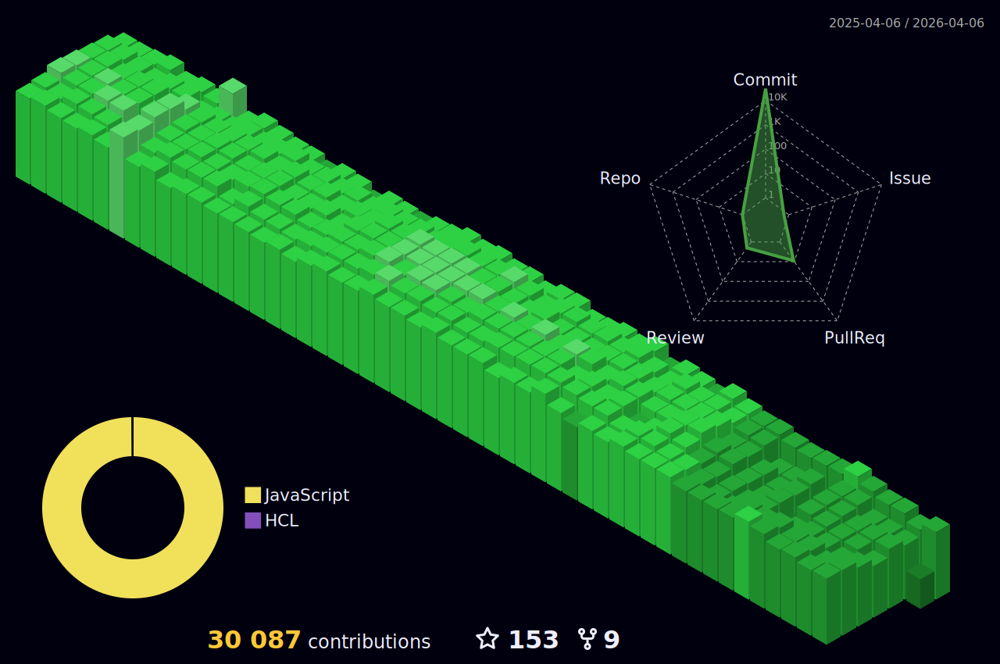

<h5 align="center">💬 Follow</h5>
<div align="center">

[](https://www.facebook.com/Horisyo/)
[](https://www.instagram.com/jrzvnn_/)
[](https://twitter.com/jrz_studies)
[](https://open.spotify.com/user/217td4qrc6mzqjodfalmzjpdi?si=b93099b9078c4ccb)
[](https://www.linkedin.com/in/jrz-vnn/)
[](mailto:jrzvnn@gmail.com)

</div>
<h4 align="center"><samp>Greetings 👋, fellow code adventurer! Prepare to embark on a journey through my GitHub repository, where every line of code has been carefully crafted to deliver maximum pun-tastic enjoyment. 🚀 </samp></h4>

<!--horizontal divider(gradiant)-->


&nbsp; 


- 🚀 Top 4 Github User in the Philipppines. [](https://user-badge.committers.top/philippines/USERNAME)
- 💻 I’m an DevOps Engineer, taking up Computer Science.
- 🤖 Currently learning AWS, Jenkins and Terraform.
- 🎯 Life Hack: Talking to a rubber ducky uncovers hidden coding errors.
- ⚡ Fun fact: Can solve a Rubik's Cube less than 15 seconds.
- 👉 `npx jrzvnn` Hit in your console or terminal to connect with me.
- 📫 How to reach me: jrzvnn@gmail.com

---

<!--🖼️OCTOCAT-->
<p align="center">


<br />
<a href="https://app.daily.dev/jorizvillanueva"></a>
</p>

<br />
<div align="center">

<!--START_SECTION:waka-->


**🐱 My GitHub Data** 

> 📦 331.3 kB Used in GitHub's Storage 
 > 
> 🏆 15,395 Contributions in the Year 2024
 > 
> 🚫 Not Opted to Hire
 > 
> 📜 49 Public Repositories 
 > 
> 🔑 4 Private Repositories 
 > 
**I'm a Night 🦉** 

```text
🌞 Morning                13403 commits       █████░░░░░░░░░░░░░░░░░░░░   18.88 % 
🌆 Daytime                14587 commits       █████░░░░░░░░░░░░░░░░░░░░   20.55 % 
🌃 Evening                21116 commits       ███████░░░░░░░░░░░░░░░░░░   29.74 % 
🌙 Night                  21892 commits       ████████░░░░░░░░░░░░░░░░░   30.83 % 
```
📅 **I'm Most Productive on Wednesday** 

```text
Monday                   8871 commits        ███░░░░░░░░░░░░░░░░░░░░░░   12.49 % 
Tuesday                  11013 commits       ████░░░░░░░░░░░░░░░░░░░░░   15.51 % 
Wednesday                11575 commits       ████░░░░░░░░░░░░░░░░░░░░░   16.30 % 
Thursday                 11465 commits       ████░░░░░░░░░░░░░░░░░░░░░   16.15 % 
Friday                   10638 commits       ████░░░░░░░░░░░░░░░░░░░░░   14.98 % 
Saturday                 9414 commits        ███░░░░░░░░░░░░░░░░░░░░░░   13.26 % 
Sunday                   8022 commits        ███░░░░░░░░░░░░░░░░░░░░░░   11.30 % 
```


📊 **This Week I Spent My Time On** 

```text
🕑︎ Time Zone: Asia/Manila

💬 Programming Languages: 
Python                   29 mins             █████████████████░░░░░░░░   66.81 % 
confini                  12 mins             ███████░░░░░░░░░░░░░░░░░░   27.29 % 
YAML                     2 mins              █░░░░░░░░░░░░░░░░░░░░░░░░   05.54 % 
Text                     0 secs              ░░░░░░░░░░░░░░░░░░░░░░░░░   00.36 % 

🔥 Editors: 
VS Code                  30 mins             █████████████████░░░░░░░░   67.17 % 
Neovim                   14 mins             ████████░░░░░░░░░░░░░░░░░   32.83 % 

💻 Operating System: 
Linux                    44 mins             █████████████████████████   100.00 % 
```

**I Mostly Code in HCL** 

```text
HCL                      14 repos            ██████░░░░░░░░░░░░░░░░░░░   23.33 % 
Python                   9 repos             ████░░░░░░░░░░░░░░░░░░░░░   15.00 % 
Dockerfile               5 repos             ██░░░░░░░░░░░░░░░░░░░░░░░   08.33 % 
TypeScript               2 repos             █░░░░░░░░░░░░░░░░░░░░░░░░   03.33 % 
R                        1 repo              ░░░░░░░░░░░░░░░░░░░░░░░░░   01.67 % 
```


 Last Updated on 22/05/2024 01:33:12 UTC
<!--END_SECTION:waka-->


<br />
<br />

```diff
+@ @ @ @ @ @ @ @ @ @ @ @ @ @ @ @ @ @ @ @ @ @ @ @ @ @ @ @+
@@       o o                                           @@
@@       | |                                           @@
@@      _L_L_                                          @@
@@   ❮\/__-__\/❯ Programming isn't about what you know @@
@@   ❮(|~o.o~|)❯  It's about what you can figure out   @@
@@   ❮/ \`-'/ \❯                                       @@
@@     _/`U'\_                                         @@
@@    ( .   . )     .----------------------------.     @@
@@   / /     \ \    | while( ! (succed=try() ) ) |     @@
@@   \ |  ,  | /    '----------------------------'     @@
@@    \|=====|/                                        @@
@@     |_.^._|                                         @@
@@     | |"| |                                         @@
@@     ( ) ( )   Testing leads to failure              @@
@@     |_| |_|   and failure leads to understanding    @@
@@ _.-' _j L_ '-._                                     @@
@@(___.'     '.___)                                    @@
+@ @ @ @ @ @ @ @ @ @ @ @ @ @ @ @ @ @ @ @ @ @ @ @ @ @ @ @+

```

</div>


[](https://github.com/ashutosh00710/github-readme-activity-graph)




<div align="center">

</div>

<div align=center>

<div align="left">
---

### 💻 Tech news for the hour

<!-- TECH:START -->
 - [Paytm&#39;s parent One 97 Communications reports a $66.1M net loss in Q4, up from $20.11M in Q4 2023, on $272.3M revenue, as it grappled with a regulatory clampdown &lpar;Manish Singh/TechCrunch&rpar;](http://www.techmeme.com/240522/p3#a240522p3)
 - [AWS says the transition from Nvidia&#39;s Grace Hopper to Blackwell chips applies only to Project Ceiba, a supercomputer that AWS and Nvidia are building together &lpar;Stephen Nellis/Reuters&rpar;](http://www.techmeme.com/240522/p2#a240522p2)
 - [London-based LabGenius, which uses ML to find and design antibody therapies to treat cancer, raised a &amp;pound;35M Series B led by Merck&#39;s VC arm, M Ventures &lpar;Mimi Billing/Sifted&rpar;](http://www.techmeme.com/240522/p1#a240522p1)
 - [Toulouse-based OneStock, which provides a cloud-native order management system to retailers, raised $72M from Summit Partners for its continued global expansion &lpar;Cate Lawrence/Tech.eu&rpar;](http://www.techmeme.com/240521/p45#a240521p45)
 - [Apple&#39;s 16-inch MacBook Pro drops to all-time low price of $1,798](https://appleinsider.com/articles/24/05/22/apples-16-inch-macbook-pro-drops-to-all-time-low-price-of-1798?utm_medium=rss)<!-- TECH:END -->

### 😂 Memes of the hour

<!-- MEMES:START -->
 - 😝 [Use ALL the cameras](http://9gag.com/gag/aryerE0)
 - 😝 [Full time job!](http://9gag.com/gag/aByQjzP)
 - 💣 [Internet trick you didn\u2019t know](http://9gag.com/gag/aoyZdOg)
 - 😝 [Haven&#39;t seen this one yet](http://9gag.com/gag/aGyVoAX)
 - 👉 [What a cool dad](http://9gag.com/gag/amoLby9)<!-- MEMES:END -->

---

---
