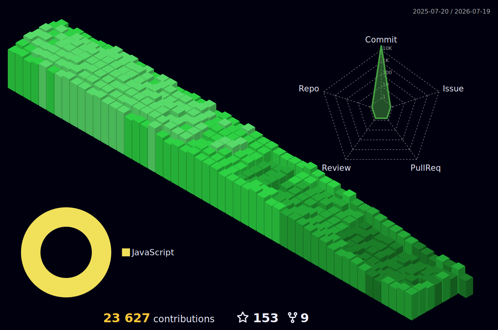

<h5 align="center">💬 Follow</h5>
<div align="center">

[](https://www.facebook.com/Horisyo/)
[](https://www.instagram.com/jrzvnn_/)
[](https://twitter.com/jrz_studies)
[](https://open.spotify.com/user/217td4qrc6mzqjodfalmzjpdi?si=b93099b9078c4ccb)
[](https://www.linkedin.com/in/jrz-vnn/)
[](mailto:jrzvnn@gmail.com)

</div>
<h4 align="center"><samp>Greetings 👋, fellow code adventurer! Prepare to embark on a journey through my GitHub repository, where every line of code has been carefully crafted to deliver maximum pun-tastic enjoyment. 🚀 </samp></h4>

<!--horizontal divider(gradiant)-->


&nbsp; 


- 🚀 Top 3 Github User in the Philipppines. [](https://user-badge.committers.top/philippines/USERNAME)
- 💻 I’m an SRE, DevOps Engineer @ Samsung Electronics.
- 🤖 Currently learning K8s & ArgoCD.
- 🎯 Life Hack: Talking to a rubber ducky uncovers hidden coding errors.
- 👉 `npx jrzvnn` Hit in your console or terminal to connect with me.
- 📫 How to reach me: jrzvnn@gmail.com

---

<!--🖼️OCTOCAT-->
<p align="center">


<br />
<a href="https://app.daily.dev/jorizvillanueva"></a>
</p>

<br />
<div align="center">

<!--START_SECTION:waka-->


**🐱 My GitHub Data** 

> 📦 357.0 kB Used in GitHub's Storage 
 > 
> 🏆 21,503 Contributions in the Year 2024
 > 
> 🚫 Not Opted to Hire
 > 
> 📜 50 Public Repositories 
 > 
> 🔑 4 Private Repositories 
 > 
**I'm a Night 🦉** 

```text
🌞 Morning                15699 commits       █████░░░░░░░░░░░░░░░░░░░░   18.89 % 
🌆 Daytime                17165 commits       █████░░░░░░░░░░░░░░░░░░░░   20.66 % 
🌃 Evening                24719 commits       ███████░░░░░░░░░░░░░░░░░░   29.75 % 
🌙 Night                  25508 commits       ████████░░░░░░░░░░░░░░░░░   30.70 % 
```
📅 **I'm Most Productive on Wednesday** 

```text
Monday                   10385 commits       ███░░░░░░░░░░░░░░░░░░░░░░   12.50 % 
Tuesday                  12827 commits       ████░░░░░░░░░░░░░░░░░░░░░   15.44 % 
Wednesday                13558 commits       ████░░░░░░░░░░░░░░░░░░░░░   16.32 % 
Thursday                 13392 commits       ████░░░░░░░░░░░░░░░░░░░░░   16.12 % 
Friday                   12403 commits       ████░░░░░░░░░░░░░░░░░░░░░   14.93 % 
Saturday                 11047 commits       ███░░░░░░░░░░░░░░░░░░░░░░   13.30 % 
Sunday                   9479 commits        ███░░░░░░░░░░░░░░░░░░░░░░   11.41 % 
```


📊 **This Week I Spent My Time On** 

```text
🕑︎ Time Zone: Asia/Manila

💬 Programming Languages: 
No Activity Tracked This Week

🔥 Editors: 
No Activity Tracked This Week

💻 Operating System: 
No Activity Tracked This Week
```

**I Mostly Code in Python** 

```text
Python                   10 repos            █████░░░░░░░░░░░░░░░░░░░░   18.18 % 
HCL                      8 repos             ████░░░░░░░░░░░░░░░░░░░░░   14.55 % 
HTML                     3 repos             █░░░░░░░░░░░░░░░░░░░░░░░░   05.45 % 
TypeScript               2 repos             █░░░░░░░░░░░░░░░░░░░░░░░░   03.64 % 
R                        1 repo              ░░░░░░░░░░░░░░░░░░░░░░░░░   01.82 % 
```


 Last Updated on 18/07/2024 01:40:44 UTC
<!--END_SECTION:waka-->


<br />
<br />

```diff
+@ @ @ @ @ @ @ @ @ @ @ @ @ @ @ @ @ @ @ @ @ @ @ @ @ @ @ @+
@@       o o                                           @@
@@       | |                                           @@
@@      _L_L_                                          @@
@@   ❮\/__-__\/❯ Programming isn't about what you know @@
@@   ❮(|~o.o~|)❯  It's about what you can figure out   @@
@@   ❮/ \`-'/ \❯                                       @@
@@     _/`U'\_                                         @@
@@    ( .   . )     .----------------------------.     @@
@@   / /     \ \    | while( ! (succed=try() ) ) |     @@
@@   \ |  ,  | /    '----------------------------'     @@
@@    \|=====|/                                        @@
@@     |_.^._|                                         @@
@@     | |"| |                                         @@
@@     ( ) ( )   Testing leads to failure              @@
@@     |_| |_|   and failure leads to understanding    @@
@@ _.-' _j L_ '-._                                     @@
@@(___.'     '.___)                                    @@
+@ @ @ @ @ @ @ @ @ @ @ @ @ @ @ @ @ @ @ @ @ @ @ @ @ @ @ @+

```

</div>


[](https://github.com/ashutosh00710/github-readme-activity-graph)




<div align="center">

</div>

<div align=center>

<div align="left">
---

### 💻 Tech news for the hour

<!-- TECH:START -->
 - [DOJ says two brothers pleaded guilty to robbing a Minnesota family of $8M+ in cryptocurrency after holding them at gunpoint for over eight hours in 2025 &lpar;Naga Avan-Nomayo/The Block&rpar;](https://www.techmeme.com/260619/p23#a260619p23)
 - [Nothing cancels this year&amp;#8217;s CMF phone due to RAM prices](https://www.theverge.com/gadgets/953066/nothing-cmf-phone-delayed-ram-prices)
 - [Sources: Abu Dhabi&#39;s MGX is exploring buying Singapore-based data center operator DayOne; last month, sources said DayOne planned a US IPO at a $20B valuation &lpar;Reuters&rpar;](https://www.techmeme.com/260619/p22#a260619p22)
 - [Docs: OpenAI burned through $3.7B in Q1, on revenue of $5.7B, and ended the quarter with $73B+ in cash and marketable securities vs. $40B at the end of December &lpar;Erin Woo/The Information&rpar;](https://www.techmeme.com/260619/p21#a260619p21)
 - [Today&#39;s NYT Connections Hints, Answers and Help for June 20, #1105](https://www.cnet.com/tech/gaming/todays-nyt-connections-hints-answers-and-help-for-june-20-1105/)<!-- TECH:END -->

### 😂 Memes of the hour

<!-- MEMES:START -->
 - 😝 [Classic tomorrow problem](http://9gag.com/gag/a7oQWnx)
 - 😝 [Hydrogen peroxide is used as paint remover. It will remove even a $15m paint job.](http://9gag.com/gag/aqy0jLp)
 - 💣 [One year ago in Scotland. Never forget.](http://9gag.com/gag/ayNGePp)
 - 😝 [Boss said not on my watch](http://9gag.com/gag/adBE8Z9)
 - 👉 [This is an insane amount of info for a short... Anyway do what you do and comment deck jokes...](http://9gag.com/gag/aQzGX28)<!-- MEMES:END -->

---

---
