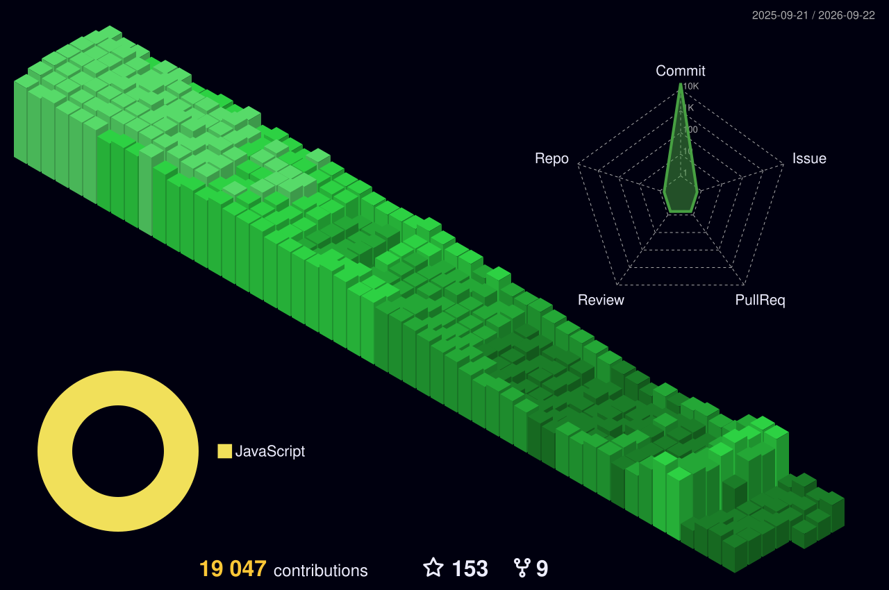

<h5 align="center">💬 Follow</h5>
<div align="center">

[](https://www.facebook.com/Horisyo/)
[](https://www.instagram.com/jrzvnn_/)
[](https://twitter.com/jrz_studies)
[](https://open.spotify.com/user/217td4qrc6mzqjodfalmzjpdi?si=b93099b9078c4ccb)
[](https://www.linkedin.com/in/jrz-vnn/)
[](mailto:jrzvnn@gmail.com)

</div>
<h4 align="center"><samp>Greetings 👋, fellow code adventurer! Prepare to embark on a journey through my GitHub repository, where every line of code has been carefully crafted to deliver maximum pun-tastic enjoyment. 🚀 </samp></h4>

<!--horizontal divider(gradiant)-->


&nbsp; 


- 🚀 Top 3 Github User in the Philipppines. [](https://user-badge.committers.top/philippines/USERNAME)
- 💻 I’m an SRE, DevOps Engineer @ Samsung Electronics.
- 🤖 Currently learning K8s & ArgoCD.
- 🎯 Life Hack: Talking to a rubber ducky uncovers hidden coding errors.
- 👉 `npx jrzvnn` Hit in your console or terminal to connect with me.
- 📫 How to reach me: jrzvnn@gmail.com

---

<!--🖼️OCTOCAT-->
<p align="center">


<br />
<a href="https://app.daily.dev/jorizvillanueva"></a>
</p>

<br />
<div align="center">

<!--START_SECTION:waka-->


**🐱 My GitHub Data** 

> 📦 357.0 kB Used in GitHub's Storage 
 > 
> 🏆 21,503 Contributions in the Year 2024
 > 
> 🚫 Not Opted to Hire
 > 
> 📜 50 Public Repositories 
 > 
> 🔑 4 Private Repositories 
 > 
**I'm a Night 🦉** 

```text
🌞 Morning                15699 commits       █████░░░░░░░░░░░░░░░░░░░░   18.89 % 
🌆 Daytime                17165 commits       █████░░░░░░░░░░░░░░░░░░░░   20.66 % 
🌃 Evening                24719 commits       ███████░░░░░░░░░░░░░░░░░░   29.75 % 
🌙 Night                  25508 commits       ████████░░░░░░░░░░░░░░░░░   30.70 % 
```
📅 **I'm Most Productive on Wednesday** 

```text
Monday                   10385 commits       ███░░░░░░░░░░░░░░░░░░░░░░   12.50 % 
Tuesday                  12827 commits       ████░░░░░░░░░░░░░░░░░░░░░   15.44 % 
Wednesday                13558 commits       ████░░░░░░░░░░░░░░░░░░░░░   16.32 % 
Thursday                 13392 commits       ████░░░░░░░░░░░░░░░░░░░░░   16.12 % 
Friday                   12403 commits       ████░░░░░░░░░░░░░░░░░░░░░   14.93 % 
Saturday                 11047 commits       ███░░░░░░░░░░░░░░░░░░░░░░   13.30 % 
Sunday                   9479 commits        ███░░░░░░░░░░░░░░░░░░░░░░   11.41 % 
```


📊 **This Week I Spent My Time On** 

```text
🕑︎ Time Zone: Asia/Manila

💬 Programming Languages: 
No Activity Tracked This Week

🔥 Editors: 
No Activity Tracked This Week

💻 Operating System: 
No Activity Tracked This Week
```

**I Mostly Code in Python** 

```text
Python                   10 repos            █████░░░░░░░░░░░░░░░░░░░░   18.18 % 
HCL                      8 repos             ████░░░░░░░░░░░░░░░░░░░░░   14.55 % 
HTML                     3 repos             █░░░░░░░░░░░░░░░░░░░░░░░░   05.45 % 
TypeScript               2 repos             █░░░░░░░░░░░░░░░░░░░░░░░░   03.64 % 
R                        1 repo              ░░░░░░░░░░░░░░░░░░░░░░░░░   01.82 % 
```


 Last Updated on 18/07/2024 01:40:44 UTC
<!--END_SECTION:waka-->


<br />
<br />

```diff
+@ @ @ @ @ @ @ @ @ @ @ @ @ @ @ @ @ @ @ @ @ @ @ @ @ @ @ @+
@@       o o                                           @@
@@       | |                                           @@
@@      _L_L_                                          @@
@@   ❮\/__-__\/❯ Programming isn't about what you know @@
@@   ❮(|~o.o~|)❯  It's about what you can figure out   @@
@@   ❮/ \`-'/ \❯                                       @@
@@     _/`U'\_                                         @@
@@    ( .   . )     .----------------------------.     @@
@@   / /     \ \    | while( ! (succed=try() ) ) |     @@
@@   \ |  ,  | /    '----------------------------'     @@
@@    \|=====|/                                        @@
@@     |_.^._|                                         @@
@@     | |"| |                                         @@
@@     ( ) ( )   Testing leads to failure              @@
@@     |_| |_|   and failure leads to understanding    @@
@@ _.-' _j L_ '-._                                     @@
@@(___.'     '.___)                                    @@
+@ @ @ @ @ @ @ @ @ @ @ @ @ @ @ @ @ @ @ @ @ @ @ @ @ @ @ @+

```

</div>


[](https://github.com/ashutosh00710/github-readme-activity-graph)




<div align="center">

</div>

<div align=center>

<div align="left">
---

### 💻 Tech news for the hour

<!-- TECH:START -->
 - [Sources: Nvidia plans to use its $6B deal with Poolside to build an open-weight AI model to compete with Chinese models like DeepSeek and Kimi &lpar;Robbie Whelan/Wall Street Journal&rpar;](https://www.techmeme.com/260822/p16#a260822p16)
 - [Sources: Iran-linked hackers shut down a small UK power plant for four days, coinciding with a wave of Iran-affiliated attacks on US water utilities &lpar;Telegraph&rpar;](https://www.techmeme.com/260822/p15#a260822p15)
 - [Sources and documents detail how Tether&#39;s plan to build two bitcoin mining sites in Uruguay fell apart amid a dispute with state utility UTE over power supply &lpar;Reuters&rpar;](https://www.techmeme.com/260822/p14#a260822p14)
 - [AI agents&#39; growing capabilities are driving productivity FOMO among some startup founders, who feel compelled to work long hours managing and guiding the agents &lpar;Katherine Bindley/Wall Street Journal&rpar;](https://www.techmeme.com/260822/p13#a260822p13)
 - [London-based Inherent, founded by DeepMind alumni and with $50M in seed funding, says its new Faraday agent beats GPT-5.5 at reproducing research paper findings &lpar;Anna Heim/TechCrunch&rpar;](https://www.techmeme.com/260822/p12#a260822p12)<!-- TECH:END -->

### 😂 Memes of the hour

<!-- MEMES:START -->
 - 😝 [Those are the facts.](http://9gag.com/gag/azxNPDx)
 - 😝 [How can microSD Cards Store So Much Data](http://9gag.com/gag/azxNPyN)
 - 💣 [Coke lover](http://9gag.com/gag/ary6Xjy)
 - 😝 [Now I can die peacefully](http://9gag.com/gag/aAyW4x9)
 - 👉 [Posting memes I found on my smartphone until I get bored or die #1743](http://9gag.com/gag/a6ZvnVL)<!-- MEMES:END -->

---

---
