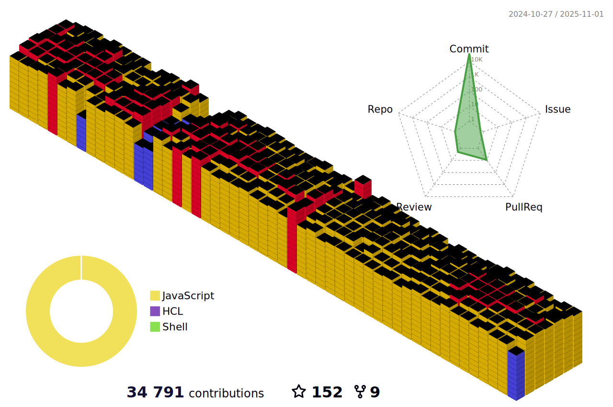

<h4 align="center"><samp>Greetings 👋, fellow code adventurer! Prepare to embark on a journey through my GitHub repository, where every line of code has been carefully crafted to deliver maximum pun-tastic enjoyment. 🚀 </samp></h4>

<div align="center">
	
</div>
&nbsp; 

* 💻 I’m an Artificial Intelligence intern, taking up Computer Science 
* 🤖 Learning NLP, AWS and FERN Stack.
* 🎯 Life Hack: Talking to a rubber ducky uncovers hidden coding errors 
* ⚡ Fun fact: Can solve a Rubik's Cube less than 15 seconds
* 👉 `npx jrzvnn` Hit in your console or terminal to connect with me.
* 📫 How to reach me: jrzvnn@gmail.com

<div align="center">

💬 **Follow**

[](https://www.facebook.com/Horisyo/)
[](https://www.instagram.com/jrzvnn_/)
[](https://twitter.com/jrz_studies)
[](https://open.spotify.com/user/217td4qrc6mzqjodfalmzjpdi?si=b93099b9078c4ccb)
[](https://www.linkedin.com/in/jrz-vnn/)
[](mailto:jrzvnn@gmail.com)


<!--START_SECTION:waka-->


**I'm an Early 🐤** 

```text
🌞 Morning                27 commits          ⬛⬛⬜⬜⬜⬜⬜⬜⬜⬜⬜⬜⬜⬜⬜⬜⬜⬜⬜⬜⬜⬜⬜⬜⬜   07.61 % 
🌆 Daytime                154 commits         ⬛⬛⬛⬛⬛⬛⬛⬛⬛⬛⬛⬜⬜⬜⬜⬜⬜⬜⬜⬜⬜⬜⬜⬜⬜   43.38 % 
🌃 Evening                80 commits          ⬛⬛⬛⬛⬛⬛⬜⬜⬜⬜⬜⬜⬜⬜⬜⬜⬜⬜⬜⬜⬜⬜⬜⬜⬜   22.54 % 
🌙 Night                  94 commits          ⬛⬛⬛⬛⬛⬛⬛⬜⬜⬜⬜⬜⬜⬜⬜⬜⬜⬜⬜⬜⬜⬜⬜⬜⬜   26.48 % 
```
📅 **I'm Most Productive on Thursday** 

```text
Monday                   41 commits          ⬛⬛⬛⬜⬜⬜⬜⬜⬜⬜⬜⬜⬜⬜⬜⬜⬜⬜⬜⬜⬜⬜⬜⬜⬜   11.55 % 
Tuesday                  56 commits          ⬛⬛⬛⬛⬜⬜⬜⬜⬜⬜⬜⬜⬜⬜⬜⬜⬜⬜⬜⬜⬜⬜⬜⬜⬜   15.77 % 
Wednesday                38 commits          ⬛⬛⬛⬜⬜⬜⬜⬜⬜⬜⬜⬜⬜⬜⬜⬜⬜⬜⬜⬜⬜⬜⬜⬜⬜   10.70 % 
Thursday                 170 commits         ⬛⬛⬛⬛⬛⬛⬛⬛⬛⬛⬛⬛⬜⬜⬜⬜⬜⬜⬜⬜⬜⬜⬜⬜⬜   47.89 % 
Friday                   14 commits          ⬛⬜⬜⬜⬜⬜⬜⬜⬜⬜⬜⬜⬜⬜⬜⬜⬜⬜⬜⬜⬜⬜⬜⬜⬜   03.94 % 
Saturday                 7 commits           ⬜⬜⬜⬜⬜⬜⬜⬜⬜⬜⬜⬜⬜⬜⬜⬜⬜⬜⬜⬜⬜⬜⬜⬜⬜   01.97 % 
Sunday                   29 commits          ⬛⬛⬜⬜⬜⬜⬜⬜⬜⬜⬜⬜⬜⬜⬜⬜⬜⬜⬜⬜⬜⬜⬜⬜⬜   08.17 % 
```


📊 **This Week I Spent My Time On** 

```text
🕑︎ Time Zone: Asia/Manila

💬 Programming Languages: 
JavaScript               2 hrs 36 mins       ⬛⬛⬛⬛⬛⬛⬛⬛⬛⬛⬜⬜⬜⬜⬜⬜⬜⬜⬜⬜⬜⬜⬜⬜⬜   41.87 % 
Markdown                 1 hr 13 mins        ⬛⬛⬛⬛⬛⬜⬜⬜⬜⬜⬜⬜⬜⬜⬜⬜⬜⬜⬜⬜⬜⬜⬜⬜⬜   19.73 % 
Python                   1 hr 5 mins         ⬛⬛⬛⬛⬜⬜⬜⬜⬜⬜⬜⬜⬜⬜⬜⬜⬜⬜⬜⬜⬜⬜⬜⬜⬜   17.53 % 
HTML                     30 mins             ⬛⬛⬜⬜⬜⬜⬜⬜⬜⬜⬜⬜⬜⬜⬜⬜⬜⬜⬜⬜⬜⬜⬜⬜⬜   08.23 % 
i3config                 22 mins             ⬛⬛⬜⬜⬜⬜⬜⬜⬜⬜⬜⬜⬜⬜⬜⬜⬜⬜⬜⬜⬜⬜⬜⬜⬜   06.03 % 

🔥 Editors: 
VS Code                  3 hrs 55 mins       ⬛⬛⬛⬛⬛⬛⬛⬛⬛⬛⬛⬛⬛⬛⬛⬛⬜⬜⬜⬜⬜⬜⬜⬜⬜   62.97 % 
Neovim                   2 hrs 18 mins       ⬛⬛⬛⬛⬛⬛⬛⬛⬛⬜⬜⬜⬜⬜⬜⬜⬜⬜⬜⬜⬜⬜⬜⬜⬜   37.03 % 

💻 Operating System: 
Linux                    6 hrs 14 mins       ⬛⬛⬛⬛⬛⬛⬛⬛⬛⬛⬛⬛⬛⬛⬛⬛⬛⬛⬛⬛⬛⬛⬛⬛⬛   100.00 % 
```

**I Mostly Code in Python** 

```text
Python                   6 repos             ⬛⬛⬛⬛⬛⬛⬜⬜⬜⬜⬜⬜⬜⬜⬜⬜⬜⬜⬜⬜⬜⬜⬜⬜⬜   24.00 % 
Jupyter Notebook         6 repos             ⬛⬛⬛⬛⬛⬛⬜⬜⬜⬜⬜⬜⬜⬜⬜⬜⬜⬜⬜⬜⬜⬜⬜⬜⬜   24.00 % 
JavaScript               2 repos             ⬛⬛⬜⬜⬜⬜⬜⬜⬜⬜⬜⬜⬜⬜⬜⬜⬜⬜⬜⬜⬜⬜⬜⬜⬜   08.00 % 
Shell                    2 repos             ⬛⬛⬜⬜⬜⬜⬜⬜⬜⬜⬜⬜⬜⬜⬜⬜⬜⬜⬜⬜⬜⬜⬜⬜⬜   08.00 % 
Ruby                     1 repo              ⬛⬜⬜⬜⬜⬜⬜⬜⬜⬜⬜⬜⬜⬜⬜⬜⬜⬜⬜⬜⬜⬜⬜⬜⬜   04.00 % 
```


 Last Updated on 04/07/2023 00:35:31 UTC
<!--END_SECTION:waka-->

 <div style="display: flex; align-items: flex-start; flex-wrap: wrap;">
  
  
  
  
  
  
   <br />
  
  
  
  
  
  
  
   <br />
  
  
  
  
  
  
  
  
  
  
</div>

<div align=center>




---

### 🎮 Game news for the hour

<!-- GAME:START -->
 - [Put These July 2023 Game Releases On Your Radar](https://kotaku.com/games-releases-july-2023-what-to-play-ps5-switch-xbox-p-1850602842)
 - [14 Weird Things Diehard Zelda: Tears of the Kingdom Fans Have To Explain](https://kotaku.com/zelda-tears-of-the-kingdom-totk-link-fairies-switch-rpg-1850601064)
 - [An online &#39;Bullet Chess&#39; championship is drawing big cash and big names](https://www.pcgamer.com/an-online-bullet-chess-championship-is-drawing-big-cash-and-big-names)
 - [GTA 6 Should Steal This Feature From Fortnite](https://kotaku.com/gta-6-grand-theft-auto-radio-stations-songs-fortnite-1850602740)
 - [Starfield and Baldur&#39;s Gate 3 have reignited the &#39;quantity vs quality&#39; debate around RPGs that promise a billion hours of gameplay, but I think they can actually deliver](https://www.pcgamer.com/starfield-and-baldurs-gate-3-have-reignited-the-quantity-vs-quality-debate-around-rpgs-that-promise-a-billion-hours-of-gameplay-but-i-think-they-can-actually-deliver)<!-- GAME:END -->

### 💻 Tech news for the hour

<!-- TECH:START -->
 - [Independence Day sales - the best tech and gadget deals this 4th of July](https://appleinsider.com/articles/23/07/04/independence-day-sales---the-best-tech-and-gadget-deals-this-4th-of-july?utm_medium=rss)
 - [Instagram&#39;s Twitter knockoff &#39;Threads&#39; now available for pre-order on the App Store](https://appleinsider.com/articles/23/07/03/instagrams-twitter-knockoff-threads-now-available-for-pre-order-on-the-app-store?utm_medium=rss)
 - [DC Fast Charging: Know Before You Go in Your Electric Car     - CNET](https://www.cnet.com/roadshow/news/dc-fast-charging-know-before-you-go-in-your-electric-car/#ftag=CAD590a51e)
 - [Instagram&#39;s Twitter competitor Threads is expected to launch on iOS on July 6, 2023 according to a pre-order listing in the App Store &lpar;Amanda Silberling/TechCrunch&rpar;](http://www.techmeme.com/230703/p25#a230703p25)
 - [Meta’s Twitter competitor launches on July 6th, according to the App Store](https://www.theverge.com/2023/7/3/23783227/meta-instagram-threads-twitter-competitor-app-store)<!-- TECH:END -->

### 😂 Memes of the hour

<!-- MEMES:START -->
 - 😝 [Sometimes there is really nothing you can do about it](http://9gag.com/gag/a2KOzrD)
 - 😝 [He definitely says what up playa](http://9gag.com/gag/aZDRqBQ)
 - ⏩ [Oh vey! Just why?](http://9gag.com/gag/avQd3xE)
 - 😝 [Gangster caught off-guard and disarmed](http://9gag.com/gag/aL1W6Nv)
 - 👉 [Israeli atrocities by a Jewish professor](http://9gag.com/gag/aYVAzy7)<!-- MEMES:END -->

---
