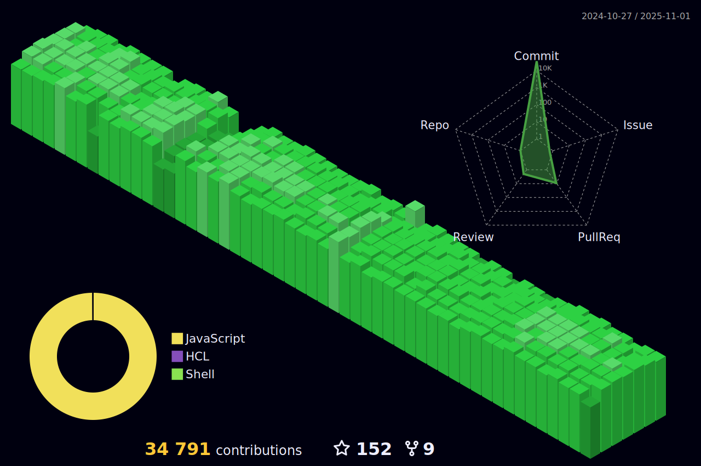

<h5 align="center">💬 Follow</h5>
<div align="center">

[](https://www.facebook.com/Horisyo/)
[](https://www.instagram.com/jrzvnn_/)
[](https://twitter.com/jrz_studies)
[](https://open.spotify.com/user/217td4qrc6mzqjodfalmzjpdi?si=b93099b9078c4ccb)
[](https://www.linkedin.com/in/jrz-vnn/)
[](mailto:jrzvnn@gmail.com)

</div>
<h4 align="center"><samp>Greetings 👋, fellow code adventurer! Prepare to embark on a journey through my GitHub repository, where every line of code has been carefully crafted to deliver maximum pun-tastic enjoyment. 🚀 </samp></h4>

<!--horizontal divider(gradiant)-->


&nbsp; 


- 🚀 Top 3 Github User in the Philipppines. [](https://user-badge.committers.top/philippines/USERNAME)
- 💻 I’m an DevOps Engineer, taking up Computer Science.
- 🤖 Currently learning AWS, Jenkins and Terraform.
- 🎯 Life Hack: Talking to a rubber ducky uncovers hidden coding errors.
- ⚡ Fun fact: Can solve a Rubik's Cube less than 15 seconds.
- 👉 `npx jrzvnn` Hit in your console or terminal to connect with me.
- 📫 How to reach me: jrzvnn@gmail.com

---

<!--🖼️OCTOCAT-->
<p align="center">


<br />
<a href="https://app.daily.dev/jorizvillanueva"></a>
</p>

<br />
<div align="center">

<!--START_SECTION:waka-->


**🐱 My GitHub Data** 

> 📦 270.4 kB Used in GitHub's Storage 
 > 
> 🏆 412 Contributions in the Year 2024
 > 
> 🚫 Not Opted to Hire
 > 
> 📜 46 Public Repositories 
 > 
> 🔑 4 Private Repositories 
 > 
**I'm a Night 🦉** 

```text
🌞 Morning                7527 commits        █████░░░░░░░░░░░░░░░░░░░░   18.34 % 
🌆 Daytime                8589 commits        █████░░░░░░░░░░░░░░░░░░░░   20.92 % 
🌃 Evening                12185 commits       ███████░░░░░░░░░░░░░░░░░░   29.68 % 
🌙 Night                  12750 commits       ████████░░░░░░░░░░░░░░░░░   31.06 % 
```
📅 **I'm Most Productive on Thursday** 

```text
Monday                   5043 commits        ███░░░░░░░░░░░░░░░░░░░░░░   12.28 % 
Tuesday                  6368 commits        ████░░░░░░░░░░░░░░░░░░░░░   15.51 % 
Wednesday                6796 commits        ████░░░░░░░░░░░░░░░░░░░░░   16.56 % 
Thursday                 6895 commits        ████░░░░░░░░░░░░░░░░░░░░░   16.80 % 
Friday                   6174 commits        ████░░░░░░░░░░░░░░░░░░░░░   15.04 % 
Saturday                 5182 commits        ███░░░░░░░░░░░░░░░░░░░░░░   12.62 % 
Sunday                   4593 commits        ███░░░░░░░░░░░░░░░░░░░░░░   11.19 % 
```


📊 **This Week I Spent My Time On** 

```text
🕑︎ Time Zone: Asia/Manila

💬 Programming Languages: 
No Activity Tracked This Week

🔥 Editors: 
No Activity Tracked This Week

💻 Operating System: 
No Activity Tracked This Week
```

**I Mostly Code in HCL** 

```text
HCL                      14 repos            ██████░░░░░░░░░░░░░░░░░░░   24.56 % 
Python                   8 repos             ████░░░░░░░░░░░░░░░░░░░░░   14.04 % 
Dockerfile               5 repos             ██░░░░░░░░░░░░░░░░░░░░░░░   08.77 % 
Shell                    5 repos             ██░░░░░░░░░░░░░░░░░░░░░░░   08.77 % 
Go                       1 repo              ░░░░░░░░░░░░░░░░░░░░░░░░░   01.75 % 
```


 Last Updated on 05/01/2024 01:27:59 UTC
<!--END_SECTION:waka-->


<br />
<br />

```diff
+@ @ @ @ @ @ @ @ @ @ @ @ @ @ @ @ @ @ @ @ @ @ @ @ @ @ @ @+
@@       o o                                           @@
@@       | |                                           @@
@@      _L_L_                                          @@
@@   ❮\/__-__\/❯ Programming isn't about what you know @@
@@   ❮(|~o.o~|)❯  It's about what you can figure out   @@
@@   ❮/ \`-'/ \❯                                       @@
@@     _/`U'\_                                         @@
@@    ( .   . )     .----------------------------.     @@
@@   / /     \ \    | while( ! (succed=try() ) ) |     @@
@@   \ |  ,  | /    '----------------------------'     @@
@@    \|=====|/                                        @@
@@     |_.^._|                                         @@
@@     | |"| |                                         @@
@@     ( ) ( )   Testing leads to failure              @@
@@     |_| |_|   and failure leads to understanding    @@
@@ _.-' _j L_ '-._                                     @@
@@(___.'     '.___)                                    @@
+@ @ @ @ @ @ @ @ @ @ @ @ @ @ @ @ @ @ @ @ @ @ @ @ @ @ @ @+

```

</div>


[](https://github.com/ashutosh00710/github-readme-activity-graph)




<div align="center">

</div>

<div align=center>

<div align="left">
---

### 💻 Tech news for the hour

<!-- TECH:START -->
 - [How a change to US tax law Section 174, forcing amortization of software labor, led to higher tax bills, less hiring and more layoffs, IP moving abroad, more &lpar;Gergely Orosz/The Pragmatic Engineer&rpar;](http://www.techmeme.com/240105/p9#a240105p9)
 - [Google’s Nest Wifi Pro has returned to its best price yet](https://www.theverge.com/2024/1/5/24025332/google-nest-wifi-pro-apple-ipad-amazon-smart-air-quality-monitor-deal-sale)
 - [Major Winter Storms Are on the Way. Here&#39;s What to Stock Up on Now     - CNET](https://www.cnet.com/home/energy-and-utilities/major-winter-storms-are-on-the-way-heres-what-to-stock-up-on-now/#ftag=CAD590a51e)
 - [California King vs. King Mattress: What to Consider for Your Bedroom     - CNET](https://www.cnet.com/health/sleep/california-king-vs-king-mattress/#ftag=CAD590a51e)
 - [Monarch: Legacy of Monsters’ new titans were inspired by the weird, freakiness of nature](https://www.theverge.com/23993939/monarch-legacy-of-monsters-sean-konrad)<!-- TECH:END -->

### 😂 Memes of the hour

<!-- MEMES:START -->
 - 😝 [Woman destroys the entire store!](http://9gag.com/gag/aNw73nv)
 - 😝 [The law of nature](http://9gag.com/gag/aeQnWqp)
 - 💣 [Current state of Europe](http://9gag.com/gag/a8qRKKe)
 - 😝 [I thought this would be greatly appreciated on 9gag](http://9gag.com/gag/aeQn7Dj)
 - 👉 [Look at them](http://9gag.com/gag/aBdAvQN)<!-- MEMES:END -->

---

---
